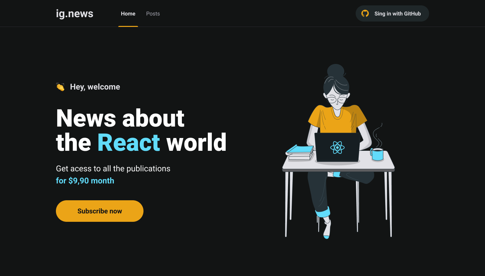
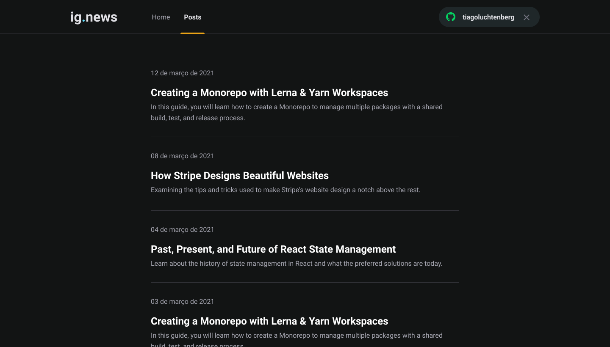
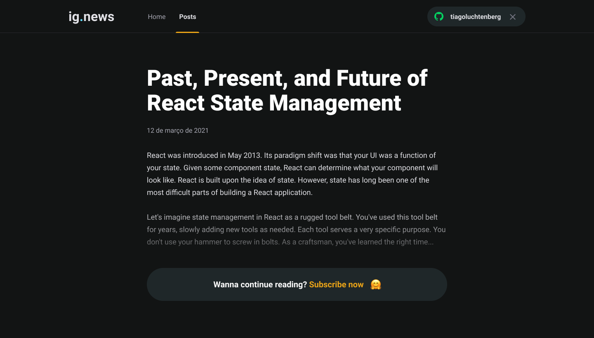
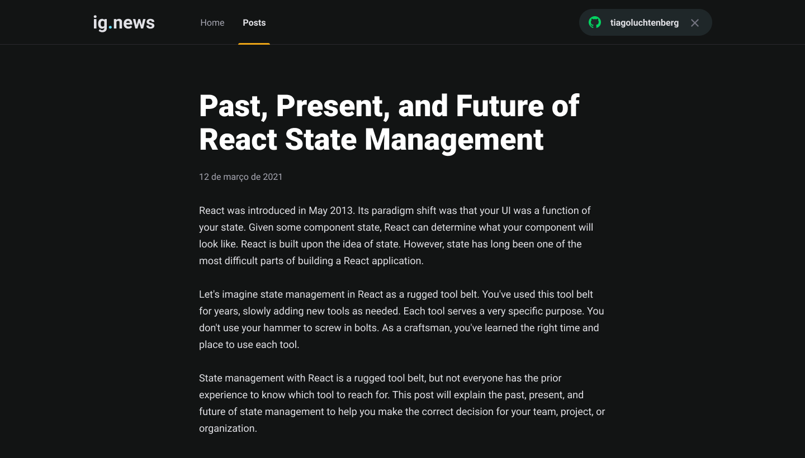

<p align="center">
  IGNEWS - notícias 📰🚀
  <br>
  <br>

  

  <a href="https://github.com/araujo-jp">
    
  </a> 

  <a href="https://github.com/araujo-jp/IgNews/commits/main">
    
  </a>

  
</p>

<h1 align="center">


</h1>

## 🚀 Sobre ## 

ig.news é um blog onde os usuários podem ter acesso ao conteúdo de cada postagem de acordo com o status de sua assinatura.
O blog possui um sistema de compra integrado com o STRIPE, e após o usuário realizar o pagamento, sua inscrição estará ativa e pronta para visualizar o conteúdo completo de todo o blog. Caso o usuário não deseje optar pela assinatura, ele terá acesso limitado ao conteúdo das postagens. E todos os dados necessários para se fazer verificações de assinaturas ou dados dos usuários, estão salvos no banco de dados FaunaDB.

Essa é uma aplicação Serverless, ou seja, todo o processo que dependeria de um backend foi integrado dentro do front e seguindo o padrão da JAMStack.
As postagens são feitas pelo painel do Prismic CMS e integradas diretamente pelo front.

---

## 🧪 Tecnologias ##

As seguintes tecnologias foram utilizadas no projeto:

- [Next.js](https://nextjs.org/)
- [Prismic CMS](https://prismic.io/)
- [Stripe](https://stripe.com/)
- [FaunaDB](https://fauna.com/)

## ✔️ Pré-requisitos ## 

Antes de começar, você vai precisar ter instalado em sua máquina as seguintes ferramentas:

- [Node JS](https://nodejs.org/)
- [Yarn](https://yarnpkg.com/lang/)

## ⚒️ Rodando a aplicação ##

```bash
# Clone this project
$ git clone https://github.com/araujo-jp/IgNews.git

# Access
$ cd IgNews

# Install dependencies
$ yarn install

# Run the project
$ yarn dev

# The server will initialize in the <http://localhost:3000
```

## 📝 Licença ##

Esse projeto está sob a licença MIT. Veja o arquivo [LICENSE](./LICENSE) para mais detalhes.


## 🖼️ Imagens ## 

<h1 align="center">
    
    
    
    
</h1>

<p align="center">Feito com :heart: by João Paulo Araújo 👋🏻</p>